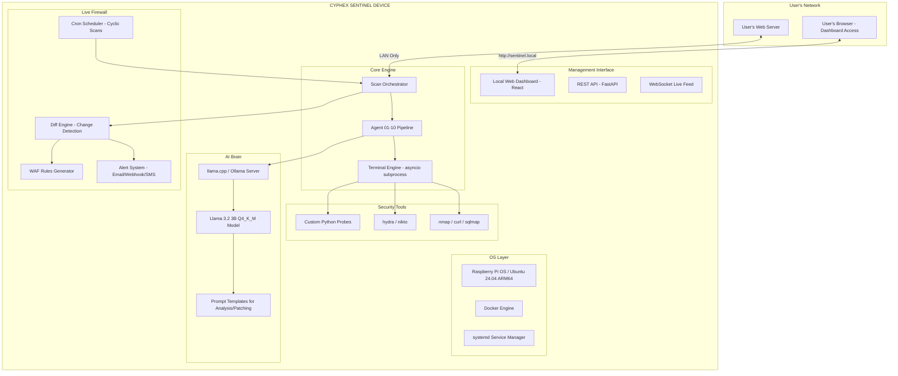

# CYPHEX IoT Security Appliance — Complete Roadmap

## 📋 Table of Contents
1. [The Big Picture — What You're Building](#the-big-picture)
2. [Is It Worth Building? Honest Assessment](#is-it-worth-building)
3. [Market Validation & Competitive Landscape](#market-validation)
4. [Hardware Selection — What to Buy](#hardware-selection)
5. [Software Architecture — How It Works](#software-architecture)
6. [AI Brain — Local Model Strategy](#ai-brain)
7. [The 10-Agent Pipeline on Device](#agent-pipeline)
8. [Live Firewall — Continuous Protection Mode](#live-firewall)
9. [Development Phases & Timeline](#development-phases)
10. [Bill of Materials (BOM)](#bill-of-materials)
11. [My Intelligence Additions — Making It Picture Perfect](#intelligence-additions)
12. [Addressing the Judge's Concern](#addressing-judge)
13. [Risks & Mitigations](#risks)

---

## 1. The Big Picture — What You're Building {#the-big-picture}

You're building a **standalone hardware appliance** — a small physical box that:

```
┌──────────────────────────────────────────────────────────────┐
│                    CYPHEX SENTINEL BOX                       │
│                                                              │
│  ┌──────────┐  ┌──────────┐  ┌──────────┐  ┌──────────┐    │
│  │  Recon   │  │ Crawler  │  │ SQLi/XSS │  │  Auth    │    │
│  │  Agent   │  │  Agent   │  │  Agents  │  │  Agent   │    │
│  └────┬─────┘  └────┬─────┘  └────┬─────┘  └────┬─────┘    │
│       │              │              │              │          │
│  ┌────▼──────────────▼──────────────▼──────────────▼────┐    │
│  │              AI BRAIN (Local LLM)                     │    │
│  │         Llama 3.2 3B / Phi-3 Mini / Qwen2.5          │    │
│  └──────────────────────┬───────────────────────────────┘    │
│                         │                                    │
│  ┌──────────────────────▼───────────────────────────────┐    │
│  │           LIVE FIREWALL ENGINE                        │    │
│  │    Continuous Scan → Detect → Alert → Patch Cycle     │    │
│  └───────────────────────────────────────────────────────┘    │
│                                                              │
│  [Ethernet] ←→ User's Server (LAN only, zero cloud)         │
└──────────────────────────────────────────────────────────────┘
```

**Key principle:** The device sits on the user's **local network**, connected via Ethernet/WiFi to their web server. It never phones home. No code leaves the premises. The AI model runs **locally** on the device itself.

---

## 2. Is It Worth Building? Honest Assessment {#is-it-worth-building}

### ✅ YES — Here's Why It's Needed

| Factor | Reality |
|--------|---------|
| **Market Gap** | No affordable hardware appliance does automated DAST + live patching for SMBs. Enterprise solutions (Qualys, Rapid7) cost $10K-$100K/year. |
| **Privacy Concern** | This is the #1 objection in cybersecurity sales. "I won't give you my code." Your device eliminates this — everything runs on-prem. |
| **Regulatory Compliance** | GDPR, HIPAA, SOC2 all prefer on-premise security tools. Cloud-based scanners are increasingly scrutinized. |
| **Edge AI Trend** | The entire industry is moving to edge computing. NVIDIA Jetson, Google Coral, and Apple Silicon prove the market believes in local AI. |
| **SMB Market** | 43% of cyberattacks target small businesses. Most can't afford a pentest team. A $200-500 hardware device is a no-brainer. |
| **Hackathon Judges** | The judge's question was valid — this device is the perfect answer. It shows you thought about real-world deployment, not just a demo. |

### ⚠️ Challenges to Be Honest About

| Challenge | Severity | Mitigation |
|-----------|----------|------------|
| **LLM on edge is slow** | High | Use quantized 3B-7B models, not 70B. Focus LLM on analysis/reporting, not exploitation. |
| **ARM compilation of security tools** | Medium | nmap, sqlmap, curl all have ARM builds. Hydra needs manual compilation. |
| **Heat management** | Medium | Raspberry Pi 5 throttles under sustained load. Use active cooling + heatsink case. |
| **False positives** | High | Your Agent 05 (Auth) and Agent 08 (Logic) already have this issue. Hardware deployment amplifies it. |
| **Power consumption** | Low | Pi 5 draws ~12W. Jetson Orin Nano draws ~15W. Both acceptable for 24/7 operation. |

### 🎯 Verdict: **ABSOLUTELY WORTH BUILDING**

This is not a toy project. This is a **real product** with a real market. The combination of:
- Multi-agent DAST pipeline ✓
- Local AI inference ✓
- Zero-cloud privacy ✓
- Hardware form factor ✓
- Continuous monitoring ✓

...doesn't exist anywhere in the market at the SMB price point. You'd be first.

---

## 3. Market Validation & Competitive Landscape {#market-validation}

### Direct Competitors (and why you're different)

| Product | Price | Approach | Your Edge |
|---------|-------|----------|-----------|
| **Firewalla** | $228-$468 | Network firewall, IDS/IPS | No DAST, no vulnerability scanning, no code analysis |
| **Qualys Scanner Appliance** | $2,000+/year | Enterprise DAST | Too expensive for SMBs, cloud-dependent |
| **OWASP ZAP** | Free (software) | DAST scanner | No hardware, no AI, no continuous monitoring |
| **Burp Suite Enterprise** | $6,995/year | Web app scanner | Software-only, expensive, no edge AI |
| **Pentera** | $50K+/year | Automated pentesting | Enterprise-only, cloud-dependent |
| **CYPHEX Sentinel** | **$200-500** | **Multi-agent DAST + AI + hardware** | **Only product combining all three at SMB price** |

### Target Market Segments

1. **Small Businesses** (1-50 employees) — "I have a website but no security team"
2. **Freelance Developers** — "I build client websites and need to prove they're secure"
3. **Managed Security Service Providers (MSSPs)** — "I manage 50 client websites"
4. **Compliance-driven Orgs** — "I need continuous security scanning for SOC2"
5. **Educational Institutions** — "I teach cybersecurity and need a lab device"

---

## 4. Hardware Selection — What to Buy {#hardware-selection}

### 🏆 Recommended: Raspberry Pi 5 (8GB) — Best Balance

This is your **primary development and v1.0 production platform**.

| Spec | Value |
|------|-------|
| **CPU** | Broadcom BCM2712, Quad-core Cortex-A76 @ 2.4GHz |
| **RAM** | 8GB LPDDR4X |
| **Storage** | NVMe SSD via HAT (256GB recommended) |
| **Network** | Gigabit Ethernet + WiFi 5 |
| **GPU** | VideoCore VII (limited, not useful for LLM) |
| **Power** | 5V/5A USB-C (27W PSU) |
| **Price** | ~$80 (board only) |
| **LLM Capability** | Llama 3.2 3B Q4 @ ~5 tokens/sec via llama.cpp |

### 🚀 Upgrade Path: NVIDIA Jetson Orin Nano (8GB) — For AI Power

When you need faster AI inference:

| Spec | Value |
|------|-------|
| **CPU** | 6-core Arm Cortex-A78AE |
| **GPU** | 1024-core NVIDIA Ampere (32 Tensor Cores) |
| **RAM** | 8GB LPDDR5 (shared CPU/GPU) |
| **AI Performance** | 40 TOPS (vs ~2 TOPS on Pi 5) |
| **Storage** | NVMe SSD (M.2 Key M) |
| **Power** | 7W-15W |
| **Price** | ~$250 (board only) |
| **LLM Capability** | Llama 3.2 7B Q4 @ ~15 tokens/sec |

### ❌ What NOT to Use

| Device | Why Not |
|--------|---------|
| **Arduino** | No OS, 2KB RAM, no networking stack. Completely unsuitable. |
| **ESP32** | 520KB RAM, no Linux. Good for sensors, useless for security scanning. |
| **Raspberry Pi Zero** | Single-core, 512MB RAM. Can't run LLM or parallel agents. |
| **Raspberry Pi 4** | Works but significantly slower CPU than Pi 5. No NVMe. |
| **Google Coral** | Only accelerates TFLite models. Can't run LLM architectures. |

### 🎯 My Recommendation: Start with Pi 5, Graduate to Jetson

```
Phase 1 (Prototype):     Raspberry Pi 5 8GB     — $80
Phase 2 (Production):    Raspberry Pi 5 8GB     — $80  (proven, cheaper)
Phase 3 (AI-Enhanced):   Jetson Orin Nano 8GB   — $250 (when you need fast LLM)
Phase 4 (Enterprise):    Jetson Orin NX 16GB    — $700 (multi-site deployments)
```

---

## 5. Software Architecture — How It Works {#software-architecture}

### System Architecture Diagram



### Key Architectural Decisions

1. **Replace Cerebras API with Local LLM**: Your current `base_agent.py` calls `call_cerebras()` via HTTPS. The IoT version replaces this with a local `ollama` or `llama.cpp` server running on `localhost:11434`.

2. **Same Agent Code, Different AI Backend**: The beautiful thing about your architecture is that `call_cerebras()` in `base_agent.py` is a single method. You only need to change ONE function to switch from cloud AI to local AI.

3. **Docker for Security Tools**: Package nmap, sqlmap, hydra inside Docker containers so they don't conflict with the host OS and can be updated independently.

4. **systemd for Always-On**: The scan scheduler runs as a systemd service that starts on boot, survives crashes, and auto-restarts.

### Code Change: Swapping Cerebras for Local LLM

Here's the **only** change needed in your existing codebase to go from cloud to edge:

```python
# base_agent.py — CURRENT (Cloud)
async def call_cerebras(self, system_prompt, user_prompt, max_retries=3):
    async with httpx.AsyncClient(timeout=60.0) as client:
        response = await client.post(
            config.CEREBRAS_API_URL,  # https://api.cerebras.ai/v1/chat/completions
            headers={"Authorization": f"Bearer {self.cerebras_key}"},
            json={"model": config.CEREBRAS_MODEL, ...}
        )

# base_agent.py — IOT VERSION (Local)
async def call_cerebras(self, system_prompt, user_prompt, max_retries=3):
    async with httpx.AsyncClient(timeout=120.0) as client:
        response = await client.post(
            "http://localhost:11434/api/chat",  # Ollama local server
            json={
                "model": "llama3.2:3b-instruct-q4_K_M",
                "messages": [
                    {"role": "system", "content": system_prompt},
                    {"role": "user", "content": user_prompt},
                ],
                "stream": False,
            }
        )
```

That's it. **Your entire 11-agent pipeline works on edge with a ~10 line change.**

---

## 6. AI Brain — Local Model Strategy {#ai-brain}

### Model Selection Matrix

| Model | Size (Q4) | RAM Needed | Speed on Pi 5 | Speed on Jetson | Quality | Recommendation |
|-------|-----------|------------|----------------|-----------------|---------|----------------|
| **Llama 3.2 1B** | 0.7GB | 1.5GB | ~12 tok/s | ~30 tok/s | ⭐⭐ | Too weak for security analysis |
| **Llama 3.2 3B** | 1.8GB | 3GB | ~5 tok/s | ~15 tok/s | ⭐⭐⭐ | **Best for Pi 5** ✅ |
| **Phi-3 Mini 3.8B** | 2.2GB | 4GB | ~4 tok/s | ~12 tok/s | ⭐⭐⭐⭐ | Great reasoning, slightly slower |
| **Qwen2.5 3B** | 1.9GB | 3.5GB | ~5 tok/s | ~14 tok/s | ⭐⭐⭐ | Good alternative to Llama |
| **Llama 3.1 8B** | 4.7GB | 6.5GB | ~1.5 tok/s | ~8 tok/s | ⭐⭐⭐⭐ | Too slow on Pi 5, good on Jetson |
| **Mistral 7B** | 4.1GB | 6GB | ~2 tok/s | ~10 tok/s | ⭐⭐⭐⭐ | **Best for Jetson** ✅ |
| **DeepSeek-R1 1.5B** | 1.0GB | 2GB | ~10 tok/s | ~25 tok/s | ⭐⭐⭐ | Great reasoning per parameter |

### 🎯 Recommended Strategy: Dual-Model Approach

```
┌─────────────────────────────────────────────────────┐
│  FAST MODEL (always loaded) — Llama 3.2 3B Q4      │
│  Used for: Quick classification, payload generation │
│  Agents: 03-08 (attack agents)                      │
│  Speed: ~5 tok/s on Pi 5                            │
│  RAM: 3GB                                           │
├─────────────────────────────────────────────────────┤
│  SMART MODEL (loaded on demand) — Phi-3 Mini 3.8B  │
│  Used for: Report generation, patch suggestions     │
│  Agents: 09 (Analysis), 10 (Patch)                  │
│  Speed: ~4 tok/s on Pi 5                            │
│  RAM: 4GB (swapped in after attack phase)           │
└─────────────────────────────────────────────────────┘
```

### Fine-Tuning for Security (Advanced)

Create a LoRA adapter trained on:
- OWASP Top 10 vulnerability descriptions
- CVE database entries (NVD)
- Your existing CYPHEX scan reports
- Security remediation patterns

This gives you a model that's **specialized for cybersecurity** without needing a massive base model.

```bash
# Fine-tuning pipeline (on a separate GPU machine, then deploy to device)
python finetune.py \
  --base_model meta-llama/Llama-3.2-3B-Instruct \
  --dataset ./security_training_data.jsonl \
  --output_dir ./cyphex-lora-adapter \
  --num_epochs 3 \
  --lora_r 16
```

---

## 7. The 10-Agent Pipeline on Device {#agent-pipeline}

### How Your Current Agents Map to IoT

| Agent | Current (Cloud) | IoT Adaptation | Performance Impact |
|-------|-----------------|----------------|--------------------|
| **01 Recon** | curl, nmap commands | ✅ Same — all CLI tools | None |
| **02 Crawler** | curl, regex parsing | ✅ Same | None |
| **03 SQLi** | curl payloads, sqlmap | ✅ Same — sqlmap available on ARM | None |
| **04 XSS** | curl payload injection | ✅ Same | None |
| **05 Auth** | curl, hydra brute force | ⚠️ hydra needs ARM compile | Slight delay |
| **06 CMDi** | curl command injection | ✅ Same | None |
| **07 LFI** | curl path traversal | ✅ Same | None |
| **08 Logic** | curl IDOR/SSRF/CORS | ✅ Same | None |
| **09 Analysis** | **Cerebras API call** | **→ Local LLM** | **Slower (30s → 2-3 min)** |
| **10 Patch** | **Cerebras API call** | **→ Local LLM** | **Slower (20s → 1-2 min)** |
| **11 Supply Chain** | curl to OSV.dev API | ✅ Same (needs internet) | None |

> [!IMPORTANT]
> **8 out of 11 agents run at IDENTICAL speed on IoT hardware.** Only the AI-powered analysis agents (09, 10) are slower because they use local inference instead of cloud API. The exploitation itself is purely I/O-bound (network calls), not compute-bound.

### Parallelism Strategy on Limited Hardware

Your current `scan_orchestrator.py` runs 6 agents in parallel via `asyncio.gather`. On a Pi 5 (4 cores), you need to throttle:

```python
# IoT-optimized orchestrator
MAX_PARALLEL_AGENTS = 3  # Down from 6
# Run in two batches of 3 instead of one batch of 6

# Batch 1: Network-heavy agents
batch_1 = [InjectionAgent, XSSAgent, AuthAgent]
# Batch 2: Logic-heavy agents
batch_2 = [LFIAgent, LogicAgent, SupplyChainAgent]

results_1 = await asyncio.gather(*[a.run(ctx) for a in batch_1])
results_2 = await asyncio.gather(*[a.run(ctx) for a in batch_2])
```

---

## 8. Live Firewall — Continuous Protection Mode {#live-firewall}

This is the **killer feature** that makes your device more than a one-shot scanner. It's a **living, breathing security guard**.

### How the Cycle Works

```
┌───────────────────────────────────────────────────────────────┐
│                  CONTINUOUS PROTECTION CYCLE                   │
│                                                                │
│   ┌─────────┐     ┌─────────┐     ┌──────────┐               │
│   │  SCAN   │────▶│ COMPARE │────▶│  DETECT  │               │
│   │ (Full)  │     │ (Diff)  │     │ (Change) │               │
│   └─────────┘     └─────────┘     └──────┬───┘               │
│       ▲                                   │                    │
│       │                                   ▼                    │
│   ┌───┴─────┐     ┌─────────┐     ┌──────────┐               │
│   │  WAIT   │◀────│  PATCH  │◀────│  ALERT   │               │
│   │ (Sleep) │     │ (Auto)  │     │ (Notify) │               │
│   └─────────┘     └─────────┘     └──────────┘               │
│                                                                │
│   Cycle time: Every 1-6 hours (configurable)                  │
└───────────────────────────────────────────────────────────────┘
```

### What the Live Firewall Actually Does

#### Layer 1: Scheduled Full Scans
```python
# cron_scheduler.py
class ContinuousScanner:
    async def run_cycle(self):
        while True:
            report = await orchestrator.run_scan(target_url)
            new_vulns = self.diff_engine.compare(self.last_report, report)
            
            if new_vulns:
                await self.alert_system.notify(new_vulns)
                await self.waf_generator.update_rules(new_vulns)
            
            self.last_report = report
            await asyncio.sleep(self.scan_interval)  # 1-6 hours
```

#### Layer 2: Lightweight Health Checks (Every 5 Minutes)
Between full scans, run quick checks:
- HTTP response code monitoring (is the site up?)
- SSL certificate expiry check
- New endpoint detection (has the attack surface changed?)
- Header security check (did someone remove security headers?)
- DNS change detection (is someone hijacking your domain?)

#### Layer 3: Traffic Anomaly Detection (Real-Time)
If the device is placed as a **network bridge** (inline between router and server):
- Monitor HTTP traffic for SQLi/XSS patterns in real-time
- Detect brute-force login attempts
- Alert on unusual request volumes (DDoS)
- Block known-malicious IPs (threat intelligence feeds)

#### Layer 4: AI-Powered Threat Assessment
After each cycle, the local LLM:
- Compares current vs. previous scan results
- Identifies **trends** (is the vulnerability count increasing?)
- Generates **risk scores** per endpoint
- Produces human-readable security briefings

### Alert System

```python
class AlertSystem:
    async def notify(self, vulns: list[Vuln]):
        for vuln in vulns:
            if vuln.severity == "Critical":
                await self.send_sms(vuln)       # Twilio API (optional, needs internet)
                await self.send_email(vuln)      # SMTP
                await self.trigger_webhook(vuln) # Slack/Discord/Teams
                await self.sound_buzzer()        # Physical buzzer on GPIO!
            elif vuln.severity == "High":
                await self.send_email(vuln)
                await self.trigger_webhook(vuln)
            else:
                await self.log_to_dashboard(vuln)
```

### Physical Indicators (GPIO)

```
┌─────────────────────────────────┐
│  CYPHEX SENTINEL — Front Panel  │
│                                  │
│  🟢 SECURE     ← All clear      │
│  🟡 WARNING    ← Medium/Low     │
│  🔴 CRITICAL   ← Critical/High  │
│  🔵 SCANNING   ← Scan in prog.  │
│                                  │
│  [LCD Display: Last scan status] │
│  [Buzzer: Alert on Critical]     │
└─────────────────────────────────┘
```

---

## 9. Development Phases & Timeline {#development-phases}

### Phase 1: Core Port (Weeks 1-3) — "It Runs on Pi"

- [ ] Flash Raspberry Pi OS 64-bit on Pi 5
- [ ] Install Python 3.11+, Docker, Node.js 20
- [ ] Install security tools: `nmap`, `curl`, `sqlmap`, `nikto`
- [ ] Compile `hydra` from source for ARM64
- [ ] Clone CYPHEX v3 backend to Pi
- [ ] Modify `config.py` for ARM detection + paths
- [ ] Test full pipeline against vulncorp sandbox
- [ ] Benchmark scan time on Pi 5 vs x86

**Deliverable:** CYPHEX pipeline running on a Raspberry Pi, scanning targets.

### Phase 2: Local AI Brain (Weeks 4-6) — "No Cloud Needed"

- [ ] Install Ollama on Pi 5 (`curl -fsSL https://ollama.ai/install.sh | sh`)
- [ ] Pull Llama 3.2 3B model (`ollama pull llama3.2:3b`)
- [ ] Create `ai_backend.py` abstraction layer (cloud vs local)
- [ ] Modify `base_agent.py` → `call_cerebras()` to use local Ollama
- [ ] Optimize prompt templates for smaller model capacity
- [ ] Test Agent 09 (Analysis) with local LLM
- [ ] Test Agent 10 (Patch) with local LLM
- [ ] Benchmark AI quality: local vs Cerebras

**Deliverable:** Full pipeline running with zero cloud dependencies.

### Phase 3: Live Firewall (Weeks 7-9) — "Always Watching"

- [ ] Build `cron_scheduler.py` — cyclic scan scheduler
- [ ] Build `diff_engine.py` — compare consecutive scan reports
- [ ] Build `alert_system.py` — email/webhook/SMS notifications
- [ ] Build `health_checker.py` — lightweight 5-minute checks
- [ ] Create systemd service file for auto-start on boot
- [ ] Add watchdog for crash recovery
- [ ] Build scan history database (SQLite)
- [ ] Implement configurable scan intervals

**Deliverable:** Device that continuously monitors and alerts on new vulnerabilities.

### Phase 4: Management Dashboard (Weeks 10-12) — "Beautiful UI"

- [ ] Adapt existing React frontend for self-hosted mode
- [ ] Build device configuration page (target URL, scan interval, alerts)
- [ ] Build historical scan timeline view
- [ ] Build vulnerability trend charts (growing/shrinking)
- [ ] Add device status page (CPU, RAM, temp, uptime)
- [ ] Setup mDNS so device is accessible at `http://cyphex.local`
- [ ] Mobile-responsive design for phone access

**Deliverable:** Full web dashboard accessible from any device on the network.

### Phase 5: Hardware Polish (Weeks 13-14) — "Looks Professional"

- [ ] Design 3D-printed enclosure (or buy aluminum case)
- [ ] Wire GPIO LEDs (Green/Yellow/Red status indicators)
- [ ] Add OLED display module for scan status
- [ ] Add physical buzzer for critical alerts
- [ ] Create setup wizard (first-boot configuration)
- [ ] Write user manual / quick start guide
- [ ] Create SD card image for easy deployment

**Deliverable:** A polished, professional-looking device ready for demo.

### Phase 6: Advanced Features (Weeks 15-20) — "Enterprise Ready"

- [ ] Multi-target support (scan multiple websites)
- [ ] WAF rule generation (auto-generate nginx/Apache rules)
- [ ] API for integration with SIEM tools
- [ ] Encrypted scan reports (AES-256)
- [ ] User authentication for dashboard
- [ ] Over-the-air (OTA) updates for agent code
- [ ] Jetson Orin Nano port for AI-heavy use cases
- [ ] Fine-tune security-specific LoRA adapter

**Deliverable:** Enterprise-grade security appliance.

---

## 10. Bill of Materials (BOM) {#bill-of-materials}

### Prototype BOM (Minimum Viable Device)

| Component | Specification | Price (USD) | Source |
|-----------|---------------|-------------|--------|
| **Raspberry Pi 5** | 8GB RAM | $80 | RPi Foundation / Adafruit |
| **NVMe HAT** | Pimoroni NVMe Base / Geekworm X1001 | $15 | Amazon/Pimoroni |
| **NVMe SSD** | 256GB M.2 2230/2242 | $25 | Amazon |
| **Power Supply** | 27W USB-C (official Pi 5 PSU) | $12 | RPi Foundation |
| **Active Cooler** | Official Pi 5 Active Cooler | $5 | RPi Foundation |
| **Case** | Argon ONE V3 M.2 (built-in NVMe slot) | $35 | Amazon |
| **Ethernet Cable** | Cat 6, 1m | $3 | Amazon |
| **MicroSD Card** | 32GB (for boot only) | $8 | Amazon |
| **LEDs + Buzzer** | GPIO kit (3 LEDs + piezo buzzer) | $5 | Amazon |
| **OLED Display** | 0.96" I2C SSD1306 128x64 | $7 | Amazon |
| | | | |
| **TOTAL** | | **~$195** | |

### Production BOM (Polished Device)

| Component | Specification | Price (USD) |
|-----------|---------------|-------------|
| Everything above | | $195 |
| **3D Printed Case** | Custom design with LED cutouts, logo | $15-30 |
| **Rubber Feet** | Anti-slip adhesive pads | $2 |
| **Label/Branding** | Custom printed sticker | $3 |
| **Packaging** | Box + foam insert | $5 |
| | | |
| **TOTAL** | | **~$225-250** |

### Enterprise BOM (Jetson-Based)

| Component | Specification | Price (USD) |
|-----------|---------------|-------------|
| **NVIDIA Jetson Orin Nano** | 8GB Developer Kit | $250 |
| **NVMe SSD** | 512GB | $40 |
| **Power Supply** | 19V/4.74A barrel jack | $15 |
| **Ethernet Cable** | Cat 6 | $3 |
| **Custom Enclosure** | CNC aluminum | $40-80 |
| **Fan + Heatsink** | Noctua NF-A4x10 | $15 |
| | | |
| **TOTAL** | | **~$370-400** |

---

## 11. My Intelligence Additions — Making It Picture Perfect {#intelligence-additions}

Here are features I'm adding to your concept that will make judges and investors say "wow":

### 🧠 1. Security Posture Score (SPS)

Instead of just listing vulnerabilities, compute a **single number** (0-100) that represents the overall security health of the website:

```
SPS = 100 - Σ(severity_weight × vuln_count × confidence)

Where:
  Critical: weight = 25
  High:     weight = 15
  Medium:   weight = 8
  Low:      weight = 3
```

Display this prominently on the device's OLED display and dashboard. Over time, track the trend.

### 📊 2. Vulnerability Heatmap

The dashboard shows a visual heatmap of the website's endpoints, colored by risk:

```
/                    🟢 Safe
/login               🔴 Critical (SQLi, brute-force)
/api/users           🔴 Critical (IDOR)
/upload              🟡 Medium (file upload bypass)
/admin               🔴 Critical (default credentials)
/search              🟡 Medium (XSS)
/api/config          🟢 Safe
```

### 🔄 3. Auto-Patch Mode (Experimental)

For supported frameworks (Express.js, Flask, Django), the device can **automatically generate and apply patches**:

1. Agent 10 generates the fix code
2. The device connects to the server via SSH
3. Creates a git branch (`cyphex-patch-XXXX`)
4. Applies the patch
5. Runs tests (if available)
6. Commits with a signed message

> [!WARNING]
> This is opt-in and should be disabled by default. Auto-modifying production code is risky. But for demo purposes, it's incredibly impressive.

### 🌐 4. Threat Intelligence Feed

Even though the device is local-first, it can optionally download:
- Updated CVE databases (daily, ~5MB)
- Known-malicious IP lists (abuse.ch, Project Honeypot)
- Updated payloads from SecLists

This keeps the device's attack knowledge current without sharing any user data.

### 📱 5. Mobile App (Flutter)

A companion mobile app that:
- Shows the Security Posture Score
- Sends push notifications on critical vulns
- Let you trigger scans remotely (over LAN or VPN)
- Shows scan history and trends

### 🔌 6. Plug-and-Play Setup

First boot experience:
1. User plugs device into their network
2. Device broadcasts an mDNS address: `http://cyphex.local`
3. User opens browser → Setup Wizard
4. Enter target URL → First scan starts
5. Device begins continuous monitoring

**Zero technical knowledge required.**

### 🏷️ 7. QR Code on Device

Print a QR code on the device that links to:
- Setup guide
- Dashboard URL
- Status page

### 🧬 8. Honeypot Mode

Deploy a lightweight honeypot alongside the scanner:
- Fake admin panels at `/admin`, `/wp-admin`, `/phpmyadmin`
- Log all attacker IPs and techniques
- Feed attacker behavior into the AI model for better detection
- Alert the user: "Someone tried to access your admin panel from IP X.X.X.X"

### 📝 9. Compliance Report Generator

Generate PDF reports formatted for:
- **SOC 2 Type II** — Security control evidence
- **PCI DSS** — Cardholder data protection
- **HIPAA** — Healthcare data security
- **ISO 27001** — Information security management

These reports can be a **premium feature** and a major selling point.

### 🔗 10. Multi-Device Mesh

For organizations with multiple websites, deploy multiple Sentinel devices that:
- Share threat intelligence with each other (over LAN)
- Provide a unified dashboard
- Coordinate scans to avoid redundant work
- Aggregate Security Posture Scores into an org-wide score

---

## 12. Addressing the Judge's Concern {#addressing-judge}

> *"Why would anyone give you their whole codebase?"*

### The Answer (Your Elevator Pitch)

**"They don't. That's the whole point."**

The CYPHEX Sentinel is a **physical device** that sits on the user's network. Here's what makes it privacy-proof:

| Concern | How Sentinel Addresses It |
|---------|--------------------------|
| "You'll see my source code" | The device never sees source code. It only makes HTTP requests to the running application — exactly like a real attacker would (DAST approach). |
| "My data goes to your cloud" | There is no cloud. The AI model runs locally on the device. Zero data leaves the network. |
| "You could backdoor the device" | The agent codebase is open-source. Users can audit every line. The device runs standard Linux. |
| "What about my database contents?" | The device only tests for vulnerabilities. Any data extracted during exploitation (like SQLi proof) stays on the device and is encrypted at rest. |
| "I don't trust internet-connected security tools" | The device works 100% offline after initial setup. Even CVE updates are optional. |

### The Technical Truth

Your CYPHEX pipeline is **DAST (Dynamic Application Security Testing)** — it only interacts with the **running application** via HTTP, never with the source code. This is the same approach used by:
- Qualys Web Application Scanning
- OWASP ZAP
- Burp Suite Scanner
- Acunetix

The IoT form factor simply moves this from "a cloud service you trust" to "a box on your shelf that you control."

---

## 13. Risks & Mitigations {#risks}

| Risk | Probability | Impact | Mitigation |
|------|-------------|--------|------------|
| **LLM quality too low for useful analysis** | Medium | High | Use prompt engineering + LoRA fine-tuning. Fall back to rule-based analysis if LLM quality is insufficient. |
| **Pi 5 overheats during sustained scanning** | Medium | Medium | Active cooling, thermal throttle limits, scan scheduling to avoid peak heat. |
| **Security tool compatibility on ARM** | Low | High | Most tools (nmap, sqlmap, curl, nikto) have ARM packages. Pre-test all tools during Phase 1. |
| **False positives cause alert fatigue** | High | High | Implement confidence scoring, severity thresholds, and alert deduplication. Only alert on changes between scans. |
| **User misconfigures and scans third-party sites** | Medium | Critical | Add legal disclaimer, rate limiting, and IP range validation (only scan LAN targets). |
| **SD card corruption** | Medium | Medium | Boot from SD, run from NVMe SSD. Regular SQLite backups. |
| **Someone physically steals the device** | Low | High | Encrypt scan data at rest with AES-256. PIN-protected dashboard. Remote wipe capability. |

---

## Summary — The 30-Second Pitch

> **CYPHEX Sentinel** is a $200 plug-and-play security appliance that acts as your website's personal cyber defense team. It runs 10 AI-powered security agents that continuously scan your web application for vulnerabilities — SQL injection, XSS, authentication bypasses, supply chain attacks — and alerts you instantly when threats are detected. Everything runs locally on the device. No cloud. No code sharing. No trust required. Just plug it into your network and sleep better at night.

---

> [!TIP]
> **Next Step:** Get a Raspberry Pi 5 8GB, flash Ubuntu 24.04 ARM64, and run your existing CYPHEX pipeline on it. That single step proves the concept and gives you a working demo in ~2 days.
